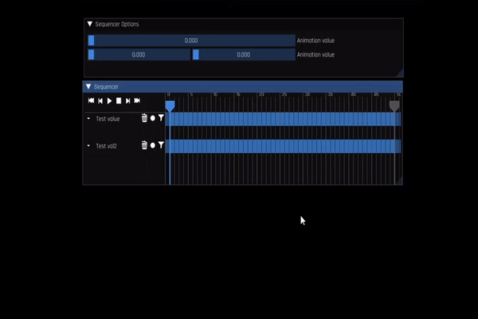
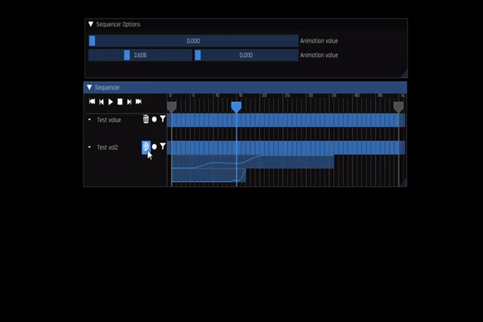
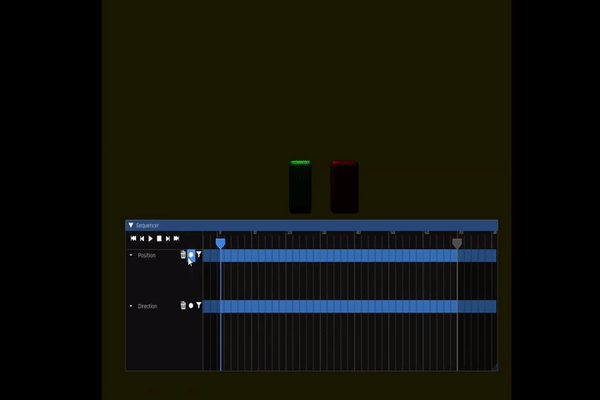
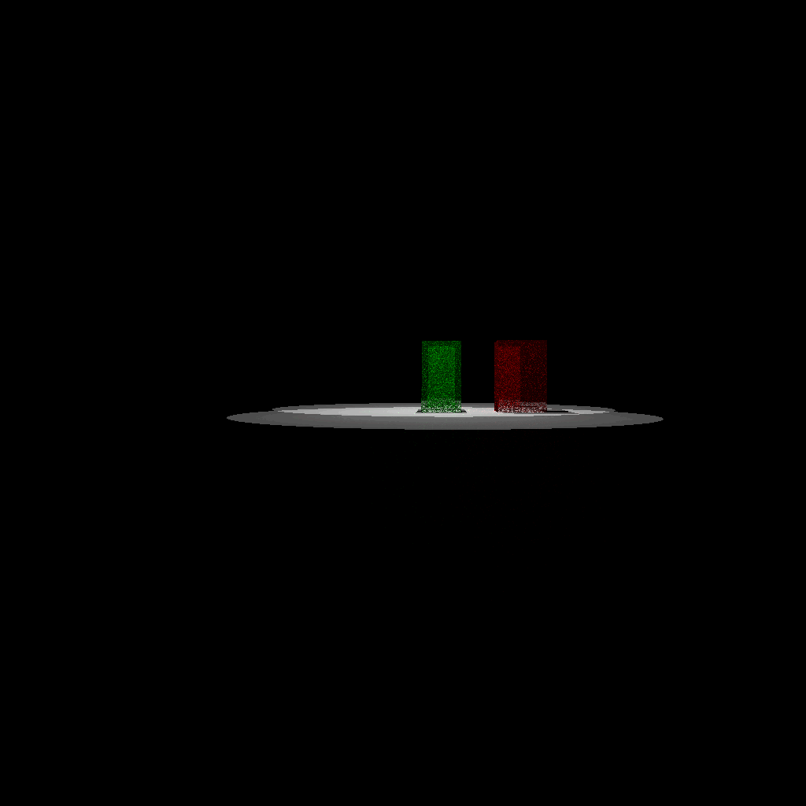

# Vector Recording and Filtering Sequencer
ImGui Sequencer designed to ease recording user interaction with a 3D scene.

Perform the following step to use the sequencer (and a c++ code below):
1. Create float variables or vectors to be manipulated.
2. Create a sequencer instance.
3. Let the sequencer know what values it should track.
4. Render the user interface with ImGui.
5. Let the sequencer know the current time, so that it can handle animation.

```cpp
// The values to be manipulated
float temp_val = 0;
glm::vec2 temp_val2 (0, 0);
VRaF::Sequencer sequencer;
sequencer.track("Test value", &temp_val);
sequencer.track("Test val2", &temp_val2);


// Somewhere in render loop:

// Setup ImGui interface
ImGui::Begin("Sequencer Options");
ImGui::SliderFloat("Animation value", (float*)&temp_val, 0, 10);
ImGui::SliderFloat2("Animation value", (float*)&temp_val2, 0, 10);
ImGui::End();

// The sequencer
ImGui::Begin("Sequencer", 0, 16);
sequencer.draw();
ImGui::End();
// We want to let the sequencer know the current time,
// so that it's able to run properly
sequencer.update((float)glfwGetTime());
```

The full code of the example is presented in main.cpp. The running app is presented below:



The sequencer is able to filter the recorded data (make it smoother)
The "filter" button will smooth the signal a little bit; so in most cases a few filtering iterations may be required.



The vectors being controlled may be the camera position and direction:



After the movements have been recordered, they can be replayed in a for-loop. In order to use them in a slow renderer, for example:

```cpp
glm::vec3 camera_position;
glm::vec3 camera_direction;
VRaF::Sequencer sequencer;
sequencer.track("Position", &camera.position);
sequencer.track("Direction", &camera.direction);

// Regular render loop...

if (ImGui::Button("Render")) {
	for (int frame : sequencer) {
		// The camera_position and camera_direction will 
		// be updated automatically.
		renderer.render(camera_position, camera_direction, std::format("out_{}.png", frame));
	}
}
```




## Acknowledgments

This sequencer was largely inspired by Sequentity
https://github.com/alanjfs/sequentity


